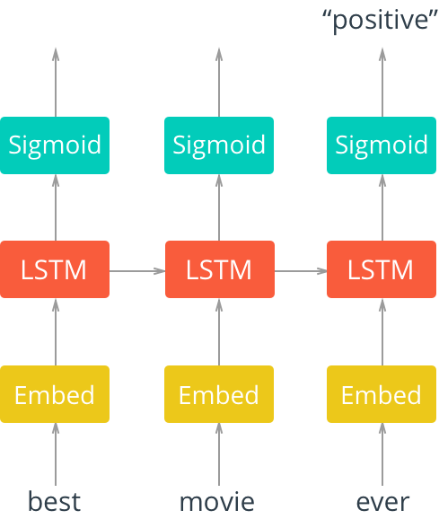

# Project: Sentiment Analysis with an RNN

In this notebook, you'll implement a recurrent neural network that performs sentiment analysis. Using an RNN rather than a feedfoward network is more accurate since we can include information about the *sequence* of words. Here we'll use a dataset of movie reviews, accompanied by labels.

The architecture for this network is shown below.



Here, we'll pass in words to an embedding layer. We need an embedding layer because we have tens of thousands of words, so we'll need a more efficient representation for our input data than one-hot encoded vectors. You should have seen this before from the word2vec lesson. You can actually train up an embedding with word2vec and use it here. But it's good enough to just have an embedding layer and let the network learn the embedding table on it's own.

From the embedding layer, the new representations will be passed to LSTM cells. These will add recurrent connections to the network so we can include information about the sequence of words in the data. Finally, the LSTM cells will go to a sigmoid output layer here. We're using the sigmoid because we're trying to predict if this text has positive or negative sentiment. The output layer will just be a single unit then, with a sigmoid activation function.

We don't care about the sigmoid outputs except for the very last one, we can ignore the rest. We'll calculate the cost from the output of the last step and the training label.

# Getting Started

```
Clone the repository into your directory:

git clone https://github.com/chjoo7/sentiment-rnn.git

Set up environment using:

pip install -r requirements.txt
```

## Data preprocessing

The first step when building a neural network model is getting your data into the proper form to feed into the network. Since we're using embedding layers, we'll need to encode each word with an integer. We'll also want to clean it up a bit.

You can see an example of the reviews data above. We'll want to get rid of those periods. Also, you might notice that the reviews are delimited with newlines `\n`. To deal with those, I'm going to split the text into each review using `\n` as the delimiter. Then I can combined all the reviews back together into one big string.

First, let's remove all punctuation. Then get all the text without the newlines and split it into individual words.

### Encoding the words

The embedding lookup requires that we pass in integers to our network. The easiest way to do this is to create dictionaries that map the words in the vocabulary to integers. Then we can convert each of our reviews into integers so they can be passed into the network.

> **Exercise:** Now you're going to encode the words with integers. Build a dictionary that maps words to integers. Later we're going to pad our input vectors with zeros, so make sure the integers **start at 1, not 0**.
> Also, convert the reviews to integers and store the reviews in a new list called `reviews_ints`. 

### LSTM cell


Next, we'll create our LSTM cells to use in the recurrent network ([TensorFlow documentation](https://www.tensorflow.org/api_docs/python/tf/contrib/rnn)). Here we are just defining what the cells look like. This isn't actually building the graph, just defining the type of cells we want in our graph.

To create a basic LSTM cell for the graph, you'll want to use `tf.contrib.rnn.BasicLSTMCell`. Looking at the function documentation:

```
tf.contrib.rnn.BasicLSTMCell(num_units, forget_bias=1.0, input_size=None, state_is_tuple=True, activation=<function tanh at 0x109f1ef28>)
```

you can see it takes a parameter called `num_units`, the number of units in the cell, called `lstm_size` in this code. So then, you can write something like 

```
lstm = tf.contrib.rnn.BasicLSTMCell(num_units)
```

to create an LSTM cell with `num_units`. Next, you can add dropout to the cell with `tf.contrib.rnn.DropoutWrapper`. This just wraps the cell in another cell, but with dropout added to the inputs and/or outputs. It's a really convenient way to make your network better with almost no effort! So you'd do something like

```
drop = tf.contrib.rnn.DropoutWrapper(cell, output_keep_prob=keep_prob)
```

Most of the time, you're network will have better performance with more layers. That's sort of the magic of deep learning, adding more layers allows the network to learn really complex relationships. Again, there is a simple way to create multiple layers of LSTM cells with `tf.contrib.rnn.MultiRNNCell`:

```
cell = tf.contrib.rnn.MultiRNNCell([drop] * lstm_layers)
```

Here, `[drop] * lstm_layers` creates a list of cells (`drop`) that is `lstm_layers` long. The `MultiRNNCell` wrapper builds this into multiple layers of RNN cells, one for each cell in the list.

So the final cell you're using in the network is actually multiple (or just one) LSTM cells with dropout. But it all works the same from an architectural viewpoint, just a more complicated graph in the cell.

> **Exercise:** Below, use `tf.contrib.rnn.BasicLSTMCell` to create an LSTM cell. Then, add drop out to it with `tf.contrib.rnn.DropoutWrapper`. Finally, create multiple LSTM layers with `tf.contrib.rnn.MultiRNNCell`.

Here is [a tutorial on building RNNs](https://www.tensorflow.org/tutorials/recurrent) that will help you out.

### RNN forward pass


Now we need to actually run the data through the RNN nodes. You can use [`tf.nn.dynamic_rnn`](https://www.tensorflow.org/api_docs/python/tf/nn/dynamic_rnn) to do this. You'd pass in the RNN cell you created (our multiple layered LSTM `cell` for instance), and the inputs to the network.

```
outputs, final_state = tf.nn.dynamic_rnn(cell, inputs, initial_state=initial_state)
```

Above I created an initial state, `initial_state`, to pass to the RNN. This is the cell state that is passed between the hidden layers in successive time steps. `tf.nn.dynamic_rnn` takes care of most of the work for us. We pass in our cell and the input to the cell, then it does the unrolling and everything else for us. It returns outputs for each time step and the final_state of the hidden layer.

> **Exercise:** Use `tf.nn.dynamic_rnn` to add the forward pass through the RNN. Remember that we're actually passing in vectors from the embedding layer, `embed`.


